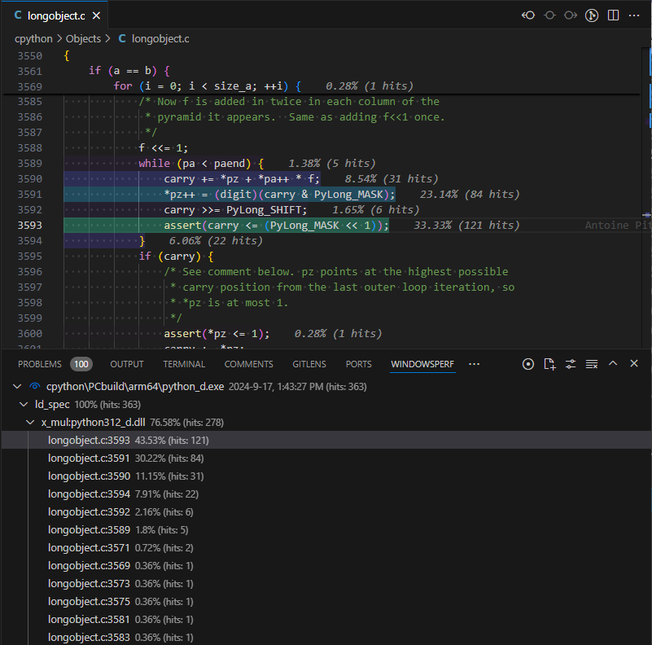

# WindowsPerf

WindowsPerf is a Visual Studio Code extension that integrates the [WindowsPerf](https://gitlab.com/Linaro/WindowsPerf/windowsperf) Windows on Arm performance profiling tool. It provides you with a simple way of viewing the results of a run of the [wperf](https://gitlab.com/Linaro/WindowsPerf/windowsperf/-/blob/main/wperf/README.md?ref_type=heads) command line tool.

You can use the WindowsPerf extension to optimize for performance on Windows on Arm. WindowsPerf uses a top-down performance analysis methodology that enables you to start with more general performance counters and then drill down into the microarchitecture to find lines in the code that correspond to events, run hotspot analysis, and view code disassembly.

The [**Sampling Settings** tab](#record-events-using-the-sampling-settings-tab) enables you to configure a run of `wperf` to perform hot spot analysis of an executable. Alternatively, you can [record events in a JSON file](#record-events-in-a-json-file).

You can then analyze the data from the run in the WindowsPerf [tree view](#use-the-windowsperf-tree-view).

> **NOTE**  
> If you are using a non-Windows on Arm machine, you can analyze results recorded in a JSON file, but you cannot record a run or use the Sampling Settings interface.

## Before you begin

Before you start using the WindowsPerf extension, you must install the WindowsPerf command-line tool and the kernel driver. Follow the instructions in the [WindowsPerf Install Guide](https://learn.arm.com/install-guides/wperf/).

## Installation

The WindowsPerf extension is available as a `.vsix` file. To install it in Visual Studio Code, follow the instructions in [Install from a VSIX](https://code.visualstudio.com/docs/editor/extension-marketplace#_install-from-a-vsix).

## Usage

In Visual Studio Code, click  or select **View: Toggle WindowsPerf** in the Command Palette to open the **WindowsPerf** tab.

There are 2 ways to use the WindowsPerf Sampling Results Explorer.

### Record events using the Sampling Settings tab

1. In the **WindowsPerf** tab, click **Record**. The **Sampling Settings** tab opens.
2. In the **Executable Path** field, specify the path to the executable file that you want to sample. You can either browse to the location where your code has been built, or enter the location directly.
3. Enter optional arguments to pass to the command (for example, `-c 10**10**10`).
4. Select an event to sample. You can select an event from the drop-down list or search for a specific event.
5. Optionally specify the frequency at which the event should be sampled. For example, if you sample the `st_spec` hardware event at a frequency of `1000` and there are 256 hits, that represents 256,000 hits of that event in your code.
6. Select a **CPU Core** to monitor from the drop-down list.
7. Optionally specify a **Timeout**.

The WindowsPerf extension updates the **Command Line Preview** as you specify your sampling settings. Click **Record** to run the command. Windows Perf runs the command for the length of time that you specified in the **Timeout** field, or until you click **Cancel**. The reulsts display in the tree view.

### Record events in a JSON file

1. Run `wperf record --annotate --disassemble --json` from the command line to capture events in a JSON file.
2. In the **WindowsPerf** tab, click **Open File**. Navigate to the location of your JSON file, select the file, and then click **Open**. The WindowsPerf tree view opens.

### Use the WindowsPerf tree view

1. For each file in your code, the tree view shows the line where the issue is and the number of times that a particular counter was hit. Every event has an entry in the tree view. Click the arrows next to an entry to drill down into individual functions.
2. Click a line in the tree view to open that file. Lines of code with event hits are colour-coded to enable you to perform hotspot analysis.
3. Move your mouse over a highlighted line to see the disassembly view. The disassembly view shows you the number of hits for the specific event, the instructions for the function, and the performance metrics for each instruction.

4. To rerun the recording with the same settings and add any new event hits to the results, click [Rerun Record]{.ui}  next to an entry in the tree view.

If you want to change any of your settings, and the **Sampling Settings** page is not visible, click [Show Sampling Settings]{.ui} .

## Telemetry

This extension collects usage telemetry and sends it to Arm to help improve our products. An example of such data includes when a recording is started, containing what the arguments are, events listening for, and erroneous results, but not containing any file names or locations.

This extension respects the Visual Studio Code telemetry settings described in the [Visual Studio Code](https://code.visualstudio.com/docs/getstarted/telemetry#_disable-telemetry-reporting) documentation. Modify telemetry options in the settings menu.

## Additional information

-   Arm Community [blog post on performance analysis methodology](https://community.arm.com/arm-community-blogs/b/infrastructure-solutions-blog/posts/arm-neoverse-n1-performance-analysis-methodology), including links to a complete list of Performance Monitoring Unit (PMU) events
-   [WindowsPerf command-line tool documentation](https://gitlab.com/Linaro/WindowsPerf/windowsperf/-/blob/main/wperf/README.md?ref_type=heads)
